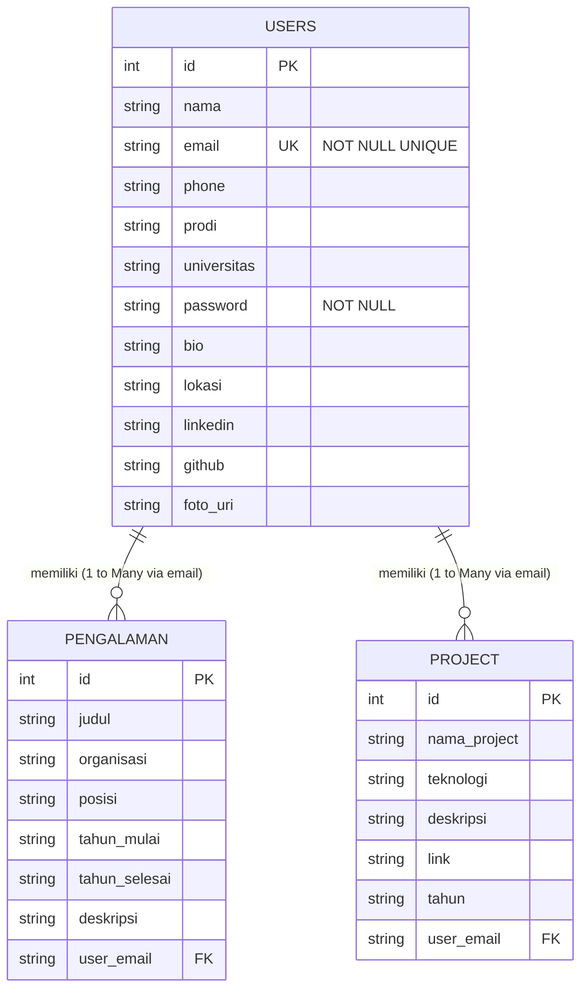

# Dokumentasi Database SkillFolio

Aplikasi **SKILLFOLIO** menggunakan database lokal **SQLite** untuk menyimpan data profil pengguna, pengalaman, dan proyek. Berikut adalah detail dokumentasi struktur database yang digunakan.

---

## Informasi Umum
* **Nama Database:** `skillfolio.db`
* **Versi Database:** `2`
* **File Helper:** [DatabaseHelper.kt](file:///c:/Users/axioo/Downloads/SkillFolio_FinalProject-master/SkillFolio_FinalProject-master/app/src/main/java/com/example/skillfoliofinal/DatabaseHelper.kt)

---

## Entity-Relationship Diagram (ERD)

---

## Detail Struktur Tabel

### 1. Tabel `users`
Tabel ini digunakan untuk menyimpan data kredensial akun, data dasar akademik, dan informasi profil tambahan (untuk kelengkapan profil).

| Nama Kolom | Tipe Data SQLite | Constraint | Deskripsi |
| :--- | :--- | :--- | :--- |
| `id` | `INTEGER` | PRIMARY KEY AUTOINCREMENT | ID unik internal untuk setiap user. |
| `nama` | `TEXT` | NOT NULL | Nama lengkap pengguna. |
| `email` | `TEXT` | NOT NULL UNIQUE | Alamat email unik, digunakan untuk login dan sebagai Foreign Key. |
| `phone` | `TEXT` | - | Nomor telepon pengguna. |
| `prodi` | `TEXT` | - | Program Studi / Jurusan pengguna. |
| `universitas` | `TEXT` | - | Nama Universitas / Instansi Pendidikan. |
| `password` | `TEXT` | NOT NULL | Password akun (plain text / siap di-hash). |
| `bio` | `TEXT` | DEFAULT '' | Deskripsi bio/biodata singkat profil. |
| `lokasi` | `TEXT` | DEFAULT '' | Kota atau lokasi tempat tinggal saat ini. |
| `linkedin` | `TEXT` | DEFAULT '' | URL/username LinkedIn pengguna. |
| `github` | `TEXT` | DEFAULT '' | URL/username GitHub pengguna. |
| `foto_uri` | `TEXT` | DEFAULT '' | Path URI foto profil lokal yang dipilih user. |

---

### 2. Tabel `pengalaman`
Tabel ini mencatat riwayat pengalaman organisasi atau pekerjaan yang dimiliki oleh pengguna.

| Nama Kolom | Tipe Data SQLite | Constraint | Deskripsi |
| :--- | :--- | :--- | :--- |
| `id` | `INTEGER` | PRIMARY KEY AUTOINCREMENT | ID unik data pengalaman. |
| `judul` | `TEXT` | - | Judul kegiatan / nama pekerjaan. |
| `organisasi` | `TEXT` | - | Nama perusahaan atau organisasi. |
| `posisi` | `TEXT` | - | Peran atau posisi yang diampu. |
| `tahun_mulai` | `TEXT` | - | Tahun mulai kegiatan (format string). |
| `tahun_selesai`| `TEXT` | - | Tahun selesai kegiatan (format string). |
| `deskripsi` | `TEXT` | - | Penjelasan detail mengenai kontribusi/tugas. |
| `user_email` | `TEXT` | FOREIGN KEY REFERENCES `users(email)` | Email pemilik data (merujuk ke tabel `users`). |

---

### 3. Tabel `project`
Tabel ini mencatat portofolio proyek yang pernah dibuat atau dikerjakan oleh pengguna.

| Nama Kolom | Tipe Data SQLite | Constraint | Deskripsi |
| :--- | :--- | :--- | :--- |
| `id` | `INTEGER` | PRIMARY KEY AUTOINCREMENT | ID unik data project. |
| `nama_project` | `TEXT` | - | Judul/Nama proyek portofolio. |
| `teknologi` | `TEXT` | - | Stack teknologi yang digunakan (misal: Kotlin, XML). |
| `deskripsi` | `TEXT` | - | Penjelasan detail tentang proyek. |
| `link` | `TEXT` | - | Tautan publik ke repositori proyek (GitHub, dll). |
| `tahun` | `TEXT` | - | Tahun pembuatan/pengerjaan proyek. |
| `user_email` | `TEXT` | FOREIGN KEY REFERENCES `users(email)` | Email pemilik data (merujuk ke tabel `users`). |
